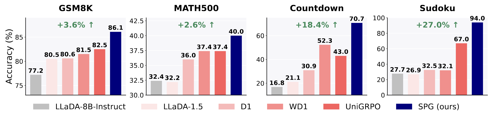

<div  align="center">
    <h1>SPG: Sandwiched Policy Gradient for Masked Diffusion Language Models</h1>
  <p>A new policy gradient algorithm, SPG, which reduces bias by optimizing sandwiched variational bounds based on reward and utilizes a block-wise masking technique to improve training efficiency and stability.</p>
</div>





<div align="center">
  <hr width="100%">
</div>


## Environment Setup

To setup the environment, run;
```
conda env create -f env.yml
conda activate spg
```
Then download the base model [LLaDA-8B-Instruct](https://huggingface.co/GSAI-ML/LLaDA-8B-Instruct) in `SAVE_DIR/hf_models/`.


## SPG


The code is inside the `spg` directory. `spg/slurm_scripts` contains the slurm scripts we used to run the RL experiments over four benchmarks. You need to change the saving directory `SAVE_DIR` for all the scripts.

Reward dynamics of SPG w/ Mixture during RL training, compared with D1, WD1, and UniGRPO:


## Evaluation

The evaluation code is inside the `eval` directory.

- Run the evaluation scripts: `sbatch_eval_llada.sh` for LLaDA-8B-Instruct; `sbatch_eval_llada1.5.sh` for LLaDA-1.5; files inside `eval_d1` for the d1 baseline; files inside `eval_eubo` for SPG w/ EUBO; files inside `eval_mix` for SPG w/ Mixture. You need to change the saving directory `SAVE_DIR` for all the scripts.
- The evaluation file will only save the generations; use the parser to calculate accuracy.
- For example, baseline generations are in the `eval_results/eval_results_gsm8k_llada` directory. Use `python parse_and_get_acc.py` to print the accuracy.


## Acknowledgement

This codebase is developed on top of [d1 (Zhao et.al, 2025)](https://github.com/dllm-reasoning/d1).
